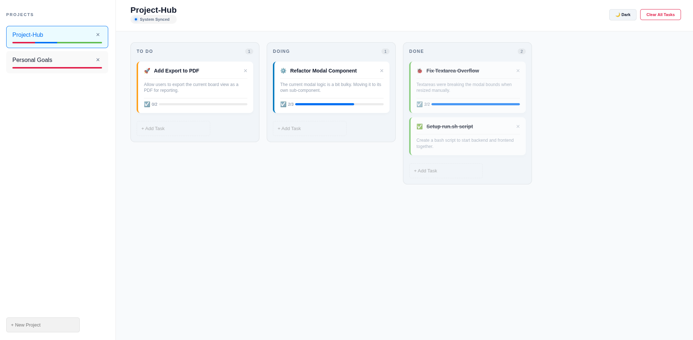
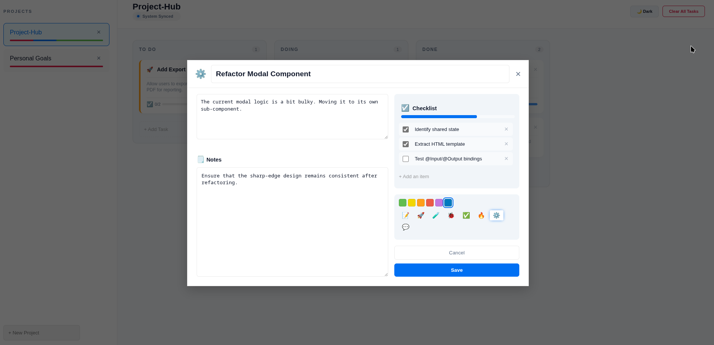

# Project-Hub

A high-performance, minimalist **Kanban Task Management** application built with a focus on developer productivity. 



---

## 🚀 Key Features

* **Fluid Kanban Interface:** Effortless task management across customizable status columns (To Do, Doing, Done).
* **Refined Task Detail Modal:** Optimized 60/40 split layout with a "Sharp-Edge" IDE-inspired design.
* **Reactive Checklists:** Real-time sub-task tracking with automated progress calculation and persistent state.
* **High-Density UI:** Expanded workspace for Descriptions and Notes, maximizing horizontal space for complex documentation.
* **Unified Control:** Single-script orchestration for Backend, Frontend, and consolidated Logging.

### 📸 Visual Preview

#### Task Detail Workspace
The detail popup is designed for deep work, featuring integrated category icons, color coding, and an expanded notes area.



---

## 🛠️ Technical Stack

* **Frontend:** Angular (running on port 4200)
* **Backend:** FastAPI / Python 3 (running on port 8000)
* **Data Persistence:** Pydantic-validated JSON storage (projects.json) with in-memory caching.
* **Security:** CORS-enabled middleware for seamless cross-origin communication between services.

## 📦 Installation & Setup

Before running, ensure you have a Python virtual environment configured in the root directory.

1. **Clone the repository:**
```bash
   git clone https://github.com/tugapse/project-hub.git
   cd project-hub
```

2. **Prepare Backend (Python 3.10+):**
```bash
   python3 -m venv .venv
   source .venv/bin/activate
   pip install fastapi uvicorn pydantic
```

3. **Install Frontend:**
```bash
   cd trello-app
   npm install
   cd ..
```

## 🖥️ Usage

The project includes a custom automation script (run.sh) to manage the full-stack lifecycle and port allocation.

**To start the application:**
```bash
chmod +x run.sh
./run.sh
```

**Automated Workflow:**
* **Database Check:** Initializes projects.json if not present.
* **Backend Startup:** Launches the FastAPI server at http://0.0.0.0:8000.
* **Frontend Startup:** Launches the Angular Dev Server at http://localhost:4200.
* **Persistence:** Every board update is synced from memory to projects.json in a human-readable format.

**To stop:** Press Ctrl+C. The script's cleanup() function will trap the signal and kill both server processes automatically to prevent port hanging.

---
*Created as part of a personal exploration into high-density UI layouts and agentic code generation workflows.*
*Maintained by tugapse.*
